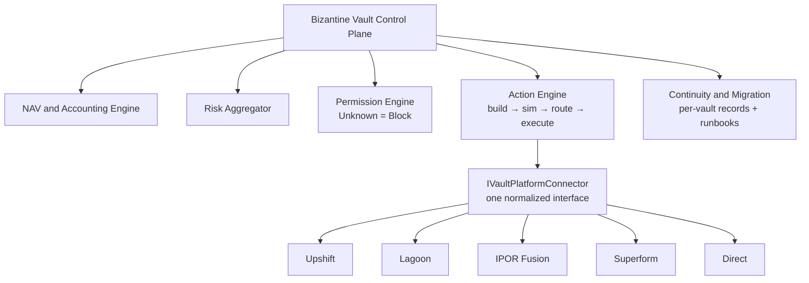

The control plane is Bizantine-owned code (off-chain TypeScript \+ on-chain Solidity) that sits above every platform and every direct vault. It reads, normalizes, permissions, risk-checks, builds, simulates, routes, and executes actions through one common model.

## Components

<CardGroup cols={2}>
  <Card title="NAV & accounting engine" icon="calculator" href="/architecture/nav-accounting">
    Deterministic, versioned valuation reconstructed independently from chain.
  </Card>

  <Card title="Risk engine" icon="triangle-exclamation" href="/architecture/risk-engine">
    Cross-platform exposure aggregation and platform-dependency risk.
  </Card>

  <Card title="Permission engine" icon="lock" href="/architecture/permission-engine">
    `Unknown = Blocked`. Verifies every precondition before returning `EXECUTABLE`.
  </Card>

  <Card title="Keeper / automation" icon="robot" href="/architecture/keeper-automation">
    Bounded automated NAV, rebalance, and harvest operations.
  </Card>
</CardGroup>

## Ownership

- **Bizantine-owned code**: all off-chain services and Direct on-chain contracts (SleeveVault, NAVSourcedSleeve, NAVSource, adapters).
- **Bizantine-controlled keys**: Safe (owner, 3-of-5, timelocked), Fordefi (curator, keeper, NAV signer), dedicated NAV signer key.
- **Bizantine-controlled roles on external platforms**: any role Bizantine holds on IPOR, Upshift, Lagoon, or Superform — verified on chain, not asserted from documentation.

## Isolation

One connector failing must never halt others. Connectors run as isolated processes so a Superform outage, Lagoon service disruption, or Upshift API failure does not stop Bizantine from reading, valuing, or operating any other vault.