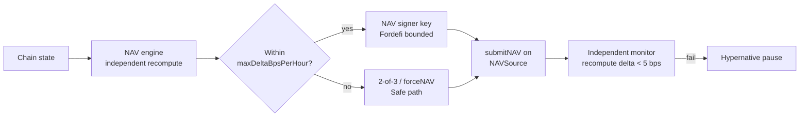

## Principles

- **Independent reconstruction.** Bizantine reconstructs NAV, positions, and history from chain wherever technically possible. Loss of a platform's dashboard or exporter costs nothing operationally.
- **Versioned methodology.** Every NAV report references a methodology version; changes require a Safe \+ timelock action.
- **Bounded steps.** A single NAV step is `≤ maxDeltaBpsPerHour · Δt` unless a 2-of-3 or `forceNAV` path is used.
- **Staleness rejection.** Actions that consume NAV reject stale inputs.

## NAV submission flow



## Cross-source validation

For every asset in a Bizantine vault, at least one independent price source is monitored alongside the vault's declared oracle. Deviation beyond a configured threshold pages the on-call and can auto-pause via Hypernative.

## Reconciliation

After every settlement, the accounting identity must hold:

```text
accounted_assets == idle + Σ adapter.totalAssets + receivables − liabilities
```

Violations are automatic pause conditions. See [Invariants](/security/invariants).