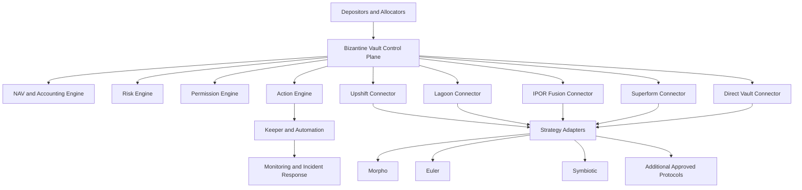

## Reading the diagram

- **Control plane** (Bizantine-owned, off-chain \+ on-chain) sits above every platform.
- **Connectors** normalize each platform into one interface. See [Platform connectors](/architecture/platform-connectors).
- **Strategy adapters** operate underlying DeFi positions and are the same shape regardless of which platform wraps them. See [Strategy adapters](/architecture/strategy-adapters).
- **Direct** is the fallback substrate: any platform position that must be exited can be re-homed into a Direct SleeveVault.

## Related diagrams

- [Transaction lifecycle](/operations/rebalancing)
- [NAV submission](/operations/nav-updates)
- [Emergency pause and unwind](/operations/emergency-unwind)
- [Platform migration](/operations/migration)