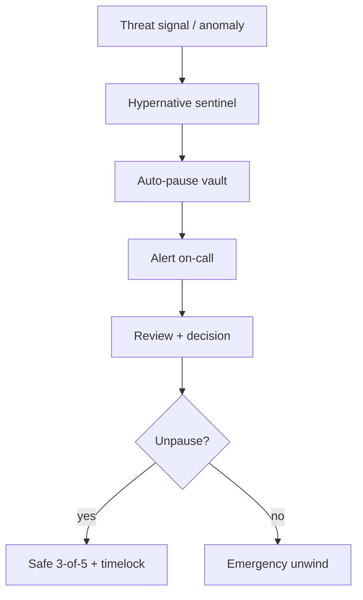

## Auto-pause triggers

- PPS delta beyond bound
- NAV recompute mismatch \> 75 bps
- Unexpected outbound transfer or unauthorized approval
- Adapter-target exploit signal
- Cross-platform: same underlying protocol flagged anywhere → pause every Bizantine vault exposed

## Manual pause

- Direct: Safe / Hypernative sentinel
- IPOR Fusion: Guardian
- Upshift: Owner multisig (co-signed)
- Lagoon: Curator / admin
- Superform: Guardian

## After pause

- Already-settled claimables remain claimable (see [Invariants](/security/invariants))
- New deposits and settlements are blocked
- The vault stays paused until Safe \+ timelock (or platform equivalent) unpauses