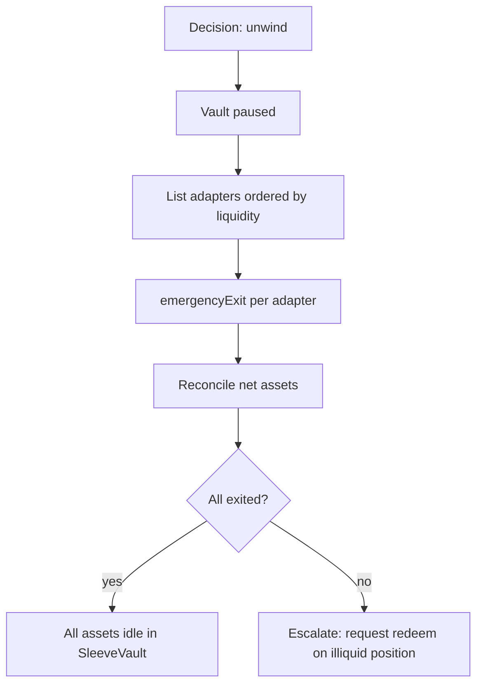

## Ordering

1. Most liquid position first (idle, ERC-4626 with high available liquidity)
2. Instant-withdraw fuses (IPOR)
3. Async request/claim positions (Lagoon, Symbiotic) — initiate `requestWithdraw`
4. Positions requiring platform cooperation last

## Illiquid positions

Symbiotic pending withdrawals are illiquid by design (7–14-day epoch). Emergency unwind for Symbiotic is limited to initiating the request; the position remains slashable until the epoch ends.

## Rollback

Rollback rehearsed with a small amount before scaling caps. See [Ship plan — go/no-go](/ship-plan/go-no-go).