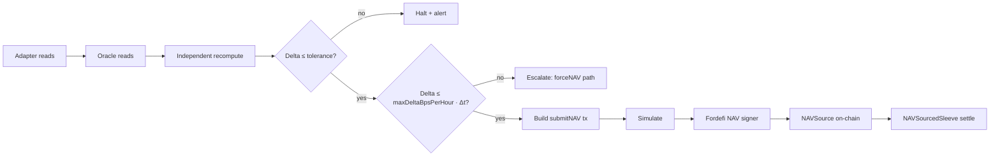

## Flow

## Bounds

- Per-vault `maxAge`
- Per-vault `maxDeltaBpsPerHour`
- Tolerance vs independent recompute (default 5 bps)
- On-chain step bound in `NAVSource`

## Freshness enforcement

Actions require the NAV `age ≤ maxAge`. Stale NAV → permission engine returns `BLOCKED`.

## Force path

A step outside the corridor requires 2-of-3 or Safe \+ timelock, never automated. Legitimate loss events use this path.