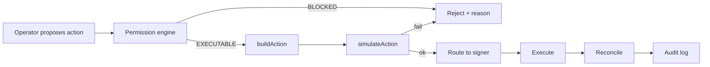

## Transaction lifecycle

## Cross-platform caps

Rebalancing across platforms is constrained by aggregated caps from the [risk engine](/architecture/risk-engine):

- Max protocol allocation (aggregated)
- Max market allocation (aggregated)
- Max platform-dependency percentage

A proposed allocation that would breach any aggregated cap is rejected before build.

## Idle buffer

Every vault holds a minimum idle buffer. Rebalance actions that would drop idle below the buffer are rejected.

## Simulation

Every rebalance is simulated (eth\_call or Tenderly). Simulation must succeed and the resulting state must be re-scanned by the risk engine before submission.