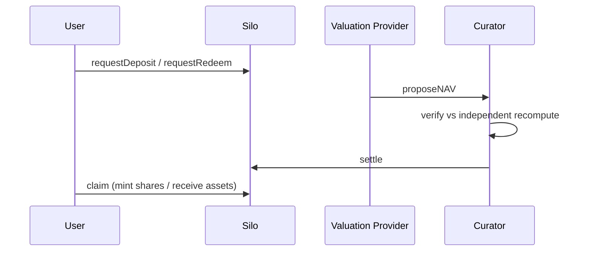

## NAV and settlement

1. Valuation provider proposes NAV
2. Curator verifies against Bizantine's independent recompute (delta ≤ 5 bps)
3. Curator settles — forward pricing applies

## Deposits and redemptions

Deposits and redemptions are **asynchronous** (ERC-7540). Users submit requests into the silo contract, which holds pending balances until settlement. After settlement, users claim.

## Strategy management

Curator executes strategy actions within the scope granted by the Zodiac Role Modifier.

## Emergency

Curator can emergency-settle. Migration requires curator cooperation — unavailable if Bizantine does not hold Curator on that vault.