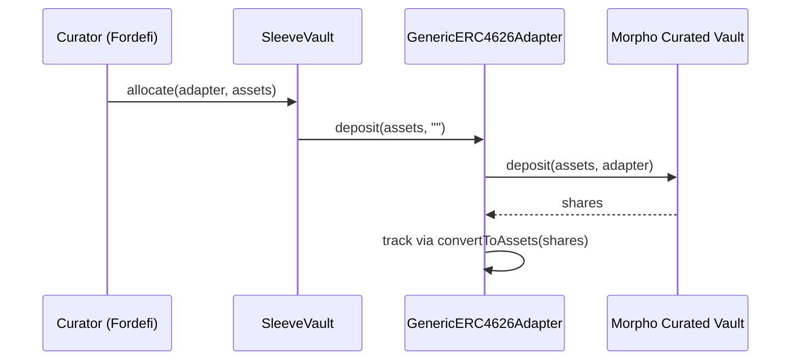

<Info>
  **Status:** `PILOT`. First Direct write path in v0.1, reached via [`GenericERC4626Adapter`](/strategies/generic-erc4626).
</Info>

## Vault model

A curated Morpho vault (MetaMorpho or Morpho Vault V2) is an ERC-4626 vault with:

| Role | Function |
| --- | --- |
| Owner | Top-level authority (timelocked) |
| Curator | Market whitelist and cap management |
| Allocator | Rebalances between whitelisted markets |
| Guardian | Veto / pause |

Plus:

- Supply queue and withdraw queue
- Per-market caps
- Timelocks on curator changes
- Valuation via `convertToAssets`

## Do not conflate liquidity concepts

The control plane must distinguish:

1. Market underlying liquidity
2. Vault-available liquidity
3. Nominal `totalAssets`
4. Immediately-withdrawable amount
5. Queue / utilization-delayed amount

Redemption planning depends on (4), not (3).

## v0.1 flow

Exit is the mirror image: `Adapter.withdraw(assets, ...)` → `MV.withdraw(assets, adapter, adapter)`.

## Fork tests

Curated-vault allocation; high-utilization withdrawal; cap breach; queue reconfig; emergency withdraw; unauthorized market (must revert).