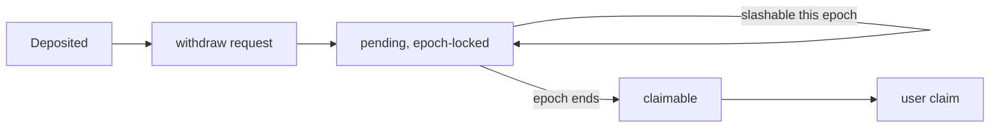

## State machine

## Timing

- Deposit: instant
- Request: any time
- Delay: 1–2 epochs (7–14 days depending on when in the epoch the request was made)
- Pending is **still slashable** until the epoch ends
- After the epoch: claimable

## Adapter accounting

Every position exposes these separately:

- `gross`
- `active delegated`
- `withdrawable` (currently, subject to request)
- `pending withdrawal`
- `claimable`
- `slashed or impaired`
- `accrued unclaimed rewards`
- `epoch-locked`

A `SYMBIOTIC_PENDING_WITHDRAWAL` position without its `liability` field is a rejected record.

## Fork tests

- Deposit → delegation → rewards → withdraw-request → claim
- Epoch rollover
- Partial withdraw
- Delayed withdraw (crosses epoch boundary)
- Emergency exit (design only in v0.1)